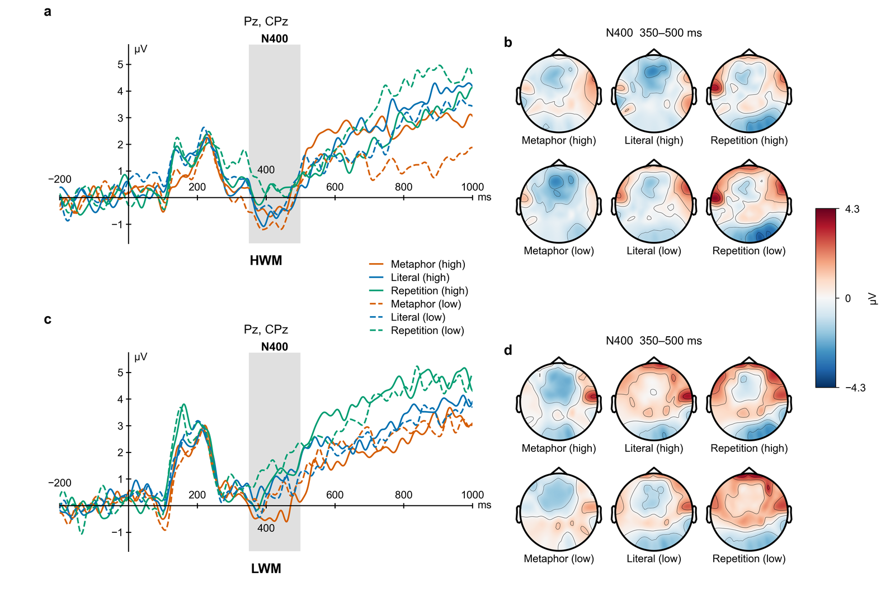
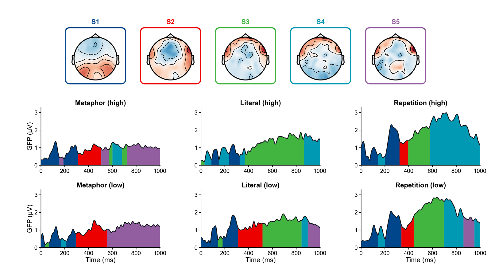
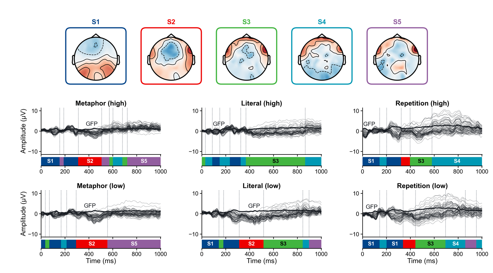

# brain-plot

Paper-ready **ERP** and **EEG microstate** figures from MNE files, in one fixed house style.

brain-plot is a [Claude Code](https://claude.com/claude-code) skill plus two plain Python scripts. The agent reads
your data, asks you a short series of questions (what the reader should see, which comparison, which components),
writes the answers into a JSON spec, gets your confirmation, draws the figure and then checks the rendered PNG. The
scripts also run on their own from the command line.

[中文说明](README.zh-CN.md)

| ERP waveforms + topographies (`combo`) | Microstate templates + segmentation |
|---|---|
|  |  |



*Figures from the author's metaphor-production study (unpublished data — please don't reuse them).*

This is a personal tool shared with a few colleagues for testing; expect changes.

## What it draws

| Figure | Command / spec | What you get |
|---|---|---|
| ERP + topography | `erp_plot.py plot`, `kind: "combo"` (default) | One figure per component: stacked waveform panels (ROI mean) with the window as a gray band, one scalp map per line to the right, shared colour scale |
| Topographies only | `kind: "topo"` | Map blocks per panel, one colour bar |
| Waveforms by channel | `kind: "erp"`, `layout: "roi"` / `"single"` / `"grid"` | ROI mean, one figure per channel (`channels: "all"`), or a channel grid |
| Overview | `erp_plot.py explore` | 3 × 3 waveform grid and a condition × component map table, for choosing windows |
| Candidate windows | `erp_plot.py windows` | Heuristic suggestions only; you decide |
| Microstate states | `microstate_plot.py plot`, `figure: "states"` | Template maps, butterfly or GFP panel, segmentation ribbon per condition (from your saved templates) |
| Microstate across K | `figure: "by-K"` | One row of templates per K, coloured by template identity |

Every figure is written as PNG (600 dpi) and SVG with editable text, plus `_caption.md` (the facts to write a caption
from, per panel) and `_run.json` (spec, subject IDs, sample bounds, versions — everything needed to reproduce it).

**It only draws.** No statistics, preprocessing, microstate clustering, source or time–frequency plots. Not supported
(the script stops): difference waves, lateralised components (N2pc, LRP), CSD, significance marks, more than 7
overlaid lines.

## Install

Requires Python ≥ 3.10.

```bash
git clone https://github.com/kyrieove/brain-plot.git
cd brain-plot
pip install -r requirements.txt          # mne, matplotlib, numpy, scipy, pandas
```

Arial or Helvetica gives the intended typography; without them matplotlib falls back to DejaVu Sans.

To use it as a Claude Code skill, make the `brain-plot/` folder available under `~/.claude/skills/`:

```bash
# macOS / Linux
ln -s "$PWD/brain-plot" ~/.claude/skills/brain-plot
```
```bat
:: Windows (cmd)
mklink /J "%USERPROFILE%\.claude\skills\brain-plot" "%CD%\brain-plot"
```

## Check the install (synthetic data)

```bash
python examples/make_demo_data.py                                   # 2 groups × 12 subjects, standard/target
python brain-plot/erp_plot.py plot examples/specs/p3_combo.json
python brain-plot/erp_plot.py plot examples/specs/grid_by_condition.json
python brain-plot/microstate_plot.py plot examples/specs/microstate_k4.json
```

Figures appear in `examples/brain-plot/` (`ERP_topo/`, `ERP/`, `microstate/`). The data are made up and only show that everything runs.

## Use it with Claude Code

In a Claude Code session:

```
/brain-plot path/to/your/epochs
```

or just ask, e.g. *"draw the P3 of both groups with topographies"*. The agent will

1. **inspect** the files (groups, conditions, trials, channels, time range, filter, reference) and read your
   analysis notes if there are any;
2. **ask in rounds**, each question with a recommended answer: the figure type and width, what the reader must see
   first, the key comparison (which variable is overlaid in a panel), groups and exclusions, components, channels
   and windows;
3. show the **spec** and wait for your yes;
4. **draw**, open the PNG and go through the QA list (overlaps, window consistency, colour scale, open items), then
   hand you the files and the caption facts.

Style (colours, polarity, fonts, colour map) follows the house defaults unless you ask for something else.

## Use it without an agent

```bash
python brain-plot/erp_plot.py inspect  path/to/data      # what is in the files
python brain-plot/erp_plot.py explore  explore.json      # overview figures
python brain-plot/erp_plot.py windows  spec.json         # candidate windows (optional)
python brain-plot/erp_plot.py plot     spec.json         # the figure
python brain-plot/microstate_plot.py plot microstate.json
```

A minimal ERP spec:

```json
{
 "data": "../epochs",
 "conditions": {"standard": "Standard", "target": "Target"},
 "components": [{"name": "P3", "channels": ["CPz", "Pz"], "tmin_ms": 300, "tmax_ms": 460,
                 "window_source": "a priori"}]
}
```

Relative `data` and `templates` paths are taken from the spec file's folder. All keys:
[`brain-plot/references/spec.md`](brain-plot/references/spec.md).

## Input data

- One MNE file per subject: `*-epo.fif` (Epochs; conditions are event names) or `*-ave.fif` (Evoked; conditions are
  comments). Subject ID = file name up to the first `_`, `-` or `.` (BIDS: `sub-01_…` → `sub-01`).
- Groups: sub-folders (`data/<group>/<subject>…`), a metadata column (`group_by`), or
  `data/<condition>/<group>/<subject>…-ave.fif`. A flat folder is one group.
- EEG in volts with channel positions (montage set). All subjects must share channels, sampling rate, time grid,
  baseline and filter; the scripts never re-reference, resample or interpolate — they stop and tell you what differs.
  Marked bad channels and flat channels also stop the run (a reference electrode kept at 0 µV can be allowed with
  `flat_channels`).

## Outputs

Everything goes to `brain-plot/` **next to the data folder**, one sub-folder per kind, with names that say what the
figure is, e.g. `ERP_topo/ERP-topo_P3_CPz-Pz_300-460ms_groups-by-condition_v01.png`. Nothing is overwritten: a
re-render becomes `_v02` and older versions move to `_history/`. A cache (`brain-plot/.cache/`, can be tens of MB)
makes later runs fast and is rebuilt when an input file changes.

## Rules and tests

- [`brain-plot/references/rules.md`](brain-plot/references/rules.md): the complete rule list (science, layout, style,
  outputs, microstate, QA checklist).
- Tests on synthetic data: `python brain-plot/test/test_erp_plot.py` and `python brain-plot/test/test_microstate.py`
  (each prints `OK`; tested with MNE 1.13 and matplotlib 3.10/3.11).
- `docs/`, `HANDOFF.md` and `research/` are the project's development notes and review history.

## License

MIT — see [LICENSE](LICENSE).
